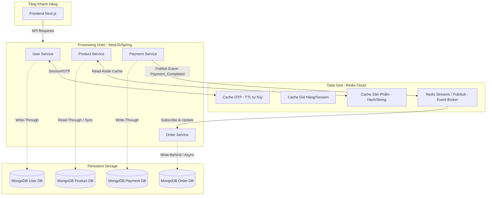

# Nghiên Cứu Áp Dụng Kiến Trúc Space-Based (SBA) Với Redis Cloud Cho Online Clothing Shop

Tài liệu này nghiên cứu giải pháp nâng cấp kiến trúc hệ thống bán hàng trực tuyến hiện tại theo mô hình **Space-Based Architecture (SBA)** kết hợp **Redis Cloud**. Mục tiêu nhằm giảm tải tối đa cho cơ sở dữ liệu chính (MongoDB/MySQL), tối ưu hóa tốc độ phản hồi (low latency) và đảm bảo hệ thống hoạt động mượt mà khi lượng người dùng truy cập tăng đột biến (flash sales, campaign quảng cáo).

---

## 1. Bản Chất Của Space-Based Architecture (SBA)

**Space-Based Architecture (SBA)** là kiểu kiến trúc được thiết kế để giải quyết triệt để vấn đề nghẽn cổ chai (bottleneck) ở tầng Cơ sở dữ liệu trung tâm khi tải tăng đột biến. 

Thay vì mọi request đọc/ghi từ các dịch vụ (Product, Order, User) đều chọc thẳng xuống Database, hệ thống sẽ sử dụng một **"Không gian bộ nhớ dùng chung" (Shared Memory Space/Data Grid)** làm trung tâm trung chuyển dữ liệu hoạt động.

### Các thành phần chính trong mô hình áp dụng:
1. **Processing Unit (Đơn vị xử lý)**: Các microservices hiện tại (`product-service`, `order-service`, `payment-service`).
2. **Virtual Middleware / Data Grid (Môi trường ảo trung gian)**: **Redis Cloud** đóng vai trò là phân vùng nhớ In-memory phân tán dùng chung cho tất cả các dịch vụ.
3. **Data Writer / Database**: MongoDB và MySQL chỉ đóng vai trò là kho lưu trữ bền vững (Persistent Storage), việc lưu vào DB sẽ được thực hiện bất đồng bộ hoặc theo mô hình định sẵn mà không gây nghẽn luồng xử lý chính.

---

## 2. Mô Hình Kiến Trúc Đề Xuất Với Redis Cloud



---

## 3. Các Chiến Lược Áp Dụng Cụ Thể

### A. Chiến lược Cache-Aside (Đọc từ Cache trước) cho Dịch vụ Sản phẩm
Với trang web thời trang, lượng khách hàng vào duyệt xem danh mục sản phẩm luôn lớn hơn gấp hàng trăm lần lượng khách hàng mua hàng (đọc >> ghi).
* **Quy trình hoạt động**:
  1. Khách hàng truy cập `/collections` hoặc xem chi tiết sản phẩm.
  2. `product-service` kiểm tra sản phẩm trong Redis Cloud bằng Key (ví dụ `product:detail:<id>`).
  3. **Cache Hit**: Trả về dữ liệu ngay lập tức từ Redis (thời gian phản hồi < 5ms).
  4. **Cache Miss**: Query vào MongoDB -> lưu kết quả vào Redis kèm thời gian tự hủy (TTL, ví dụ 1 tiếng) -> trả dữ liệu về client.
  5. **Đồng bộ khi cập nhật**: Khi Quản trị viên cập nhật thông tin sản phẩm hoặc chỉnh sửa số lượng tồn kho, hệ thống tiến hành cập nhật MongoDB và đồng thời xóa/ghi đè Key tương ứng trên Redis Cloud để tránh dữ liệu bị lệch (stale data).

### B. Lưu trữ Session tạm thời & OTP (Thời gian sống ngắn)
Các mã OTP xác thực email hoặc đặt lại mật khẩu có tuổi thọ rất ngắn (1-10 phút). Việc ghi liên tục các bản ghi này vào MongoDB Atlas sẽ tạo ra rác và làm chậm DB.
* **Giải pháp**:
  * Lưu OTP trực tiếp vào Redis Cloud với Key `otp:email:<email>` và cấu hình tính năng **TTL (Time-To-Live)** của Redis tự động hủy dữ liệu sau 10 phút.
  * Việc xác thực và cooldown 30s gửi lại OTP sẽ được kiểm tra In-Memory siêu tốc.

### C. Giao tiếp Event-Driven thông qua Redis Streams / PubSub
Hiện tại, khi SePay bắn webhook về, `payment-service` đang gọi HTTP PATCH trực tiếp sang `order-service` để cập nhật trạng thái đơn hàng. Nếu `order-service` gặp sự cố (mạng lỗi, quá tải, tắt đột ngột), giao dịch thanh toán sẽ bị treo và không đối soát được.
* **Giải pháp áp dụng SBA**:
  * Khi `payment-service` xác nhận thanh toán thành công, thay vì gọi HTTP, nó sẽ **Publish** một sự kiện `order:paid` vào **Redis Streams**.
  * Dữ liệu giao dịch được lưu trữ tạm thời trong Redis.
  * `order-service` liên tục lắng nghe (Subscribe) kênh sự kiện này. Khi nhận được tin nhắn, nó tiến hành cập nhật đơn hàng thành `PAID` và gửi tín hiệu xác nhận (ACK) về Redis.
  * Nếu `order-service` tạm thời bị tắt, tin nhắn vẫn được lưu an toàn trong Redis Streams và sẽ được xử lý ngay khi dịch vụ khởi động lại, đảm bảo tính nhất quán tuyệt đối của dữ liệu giao dịch (Fault Tolerance).

---

## 4. Hướng Dẫn Tích Hợp Redis Cloud Vào NestJS

### Bước 1: Cài đặt thư viện Redis Client
Chạy lệnh cài đặt thư viện client Redis chính thức cho Node.js:
```bash
pnpm add redis @nestjs/cache-manager cache-manager cache-manager-redis-yet
```

### Bước 2: Khai báo cấu hình trong file `.env`
Đăng ký tài khoản Redis Cloud miễn phí tại [redis.io](https://redis.io) và lấy thông tin kết nối điền vào file `.env`:
```env
REDIS_HOST=redis-12345.c291.ap-southeast-1-1.ec2.redns.redis-cloud.com
REDIS_PORT=12345
REDIS_PASSWORD=your_secure_redis_cloud_password
```

### Bước 3: Code mẫu tích hợp Cache-Aside tại Product Service
Cấu hình CacheModule trong `AppModule` của `product-service`:

```typescript
// products.module.ts
import { Module } from '@nestjs/common';
import { CacheModule } from '@nestjs/cache-manager';
import { redisStore } from 'cache-manager-redis-yet';
import { ProductsService } from './products.service';
import { ProductsController } from './products.controller';

@Module({
  imports: [
    CacheModule.registerAsync({
      useFactory: async () => ({
        store: await redisStore({
          socket: {
            host: process.env.REDIS_HOST,
            port: parseInt(process.env.REDIS_PORT || '6379'),
          },
          password: process.env.REDIS_PASSWORD,
          ttl: 3600 * 1000, // Cache mặc định trong 1 tiếng (millisecond)
        }),
      }),
    }),
  ],
  providers: [ProductsService],
  controllers: [ProductsController],
})
export class ProductsModule {}
```

Sử dụng Cache trong `ProductsService` để tăng tốc đọc thông tin chi tiết sản phẩm:

```typescript
// products.service.ts
import { Injectable, Inject } from '@nestjs/common';
import { CACHE_MANAGER } from '@nestjs/cache-manager';
import { Cache } from 'cache-manager';
import { InjectModel } from '@nestjs/mongoose';
import { Model } from 'mongoose';
import { Product } from './schemas/product.schema';

@Injectable()
export class ProductsService {
  constructor(
    @InjectModel(Product.name) private productModel: Model<Product>,
    @Inject(CACHE_MANAGER) private cacheManager: Cache,
  ) {}

  async getProductDetail(id: string): Promise<Product> {
    const cacheKey = `product:detail:${id}`;
    
    // 1. Kiểm tra trong Redis Cache trước
    const cachedProduct = await this.cacheManager.get<Product>(cacheKey);
    if (cachedProduct) {
      return cachedProduct; // Cache hit
    }

    // 2. Cache miss: Query MongoDB Atlas
    const product = await this.productModel.findById(id);
    if (product) {
      // 3. Lưu vào Redis Cache cho các lần truy cập sau
      await this.cacheManager.set(cacheKey, product, 3600 * 1000); 
    }
    
    return product;
  }
}
```

---

## 5. Kết Luận & Đánh Giá Hiệu Năng
* **Giảm tải Database chính**: Giúp giảm đến **80% - 90%** các câu lệnh query đọc lặp đi lặp lại vào MongoDB Atlas, bảo vệ DB khỏi bị treo khi lượng truy cập tăng vọt.
* **Tăng tốc phản hồi (Tải trang tức thì)**: Thời gian phản hồi API sản phẩm giảm từ trung bình ~80ms-150ms (do độ trễ kết nối cloud database) xuống **dưới 5ms** nhờ lấy trực tiếp In-Memory từ Redis Cloud ở khu vực Đông Nam Á.
* **Cải thiện độ bền hệ thống (Fault Tolerance)**: Áp dụng Redis Streams giúp luồng đối soát thanh toán đơn hàng hoạt động bất đồng bộ cực kỳ an toàn, không lo mất mát đơn hàng khi xảy ra sự cố mạng liên dịch vụ.
