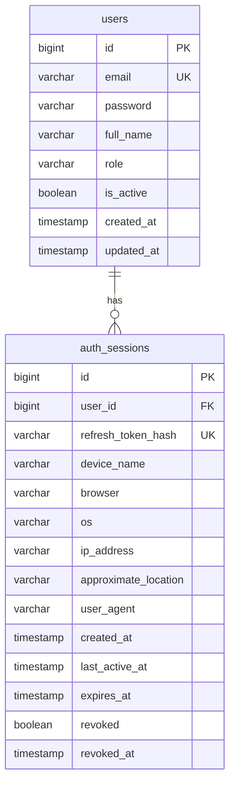
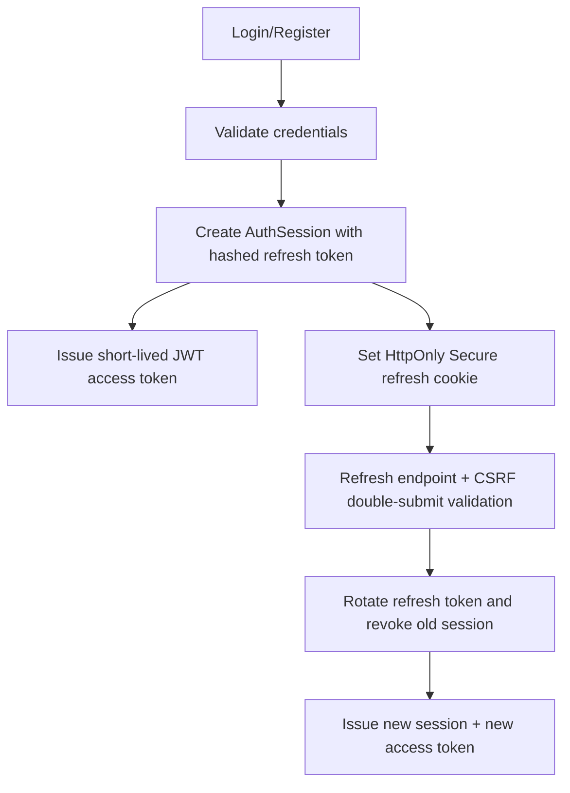

# Authentication and Session Management Design

## Project Structure (auth-related)

- `controller`
  - `AuthController`
  - `SessionController`
- `service`
  - `AuthService`
  - `SessionService`
  - `LoginAttemptService`
- `repository`
  - `UserRepository`
  - `AuthSessionRepository`
- `entity`
  - `User`
  - `AuthSession`
- `dto`
  - requests: `RegisterRequest`, `LoginRequest`, `ChangePasswordRequest`, `SessionPasswordConfirmRequest`
  - responses: `AuthResponse`, `SessionResponse`, `ApiResponse`
- `security`
  - `JwtTokenProvider`
  - `JwtAuthenticationFilter`
  - `RefreshTokenCookieService`
  - `CsrfCookieService`
  - `RefreshCsrfProtectionFilter`
  - `TokenHashService`
  - `RefreshTokenGenerator`
  - `DeviceMetadataResolver`
- `config`
  - `SecurityConfig`
  - `JwtProperties`
  - `SecurityProperties`
  - `WebConfig`
- `exception`
  - `GlobalExceptionHandler`

## ERD



## Authentication Flow



## Session Management Flow

```mermaid
flowchart TD
    A[GET /sessions] --> B[List active auth_sessions for user]
    C[DELETE /sessions/{id}] --> D[Verify ownership + password]
    D --> E[Mark session revoked]
    F[DELETE /sessions/logout-all] --> G[Verify password]
    G --> H[Revoke all other active sessions]
```

## Token Strategy

- Access token: JWT (5-15 min), minimal claims: `sub`, `roles`, `sessionId`, `iat`, `exp`.
- Refresh token: opaque 64-byte secure random token in HttpOnly cookie.
- Stored token format: SHA-256 hash in DB (`refresh_token_hash`), never raw refresh token.
- Rotation: every refresh revokes previous session/token and creates a new session.
- Revocation: session-level revocation (`revoked`, `revoked_at`) + access-token blacklist by `jti` in Redis.

## Why not localStorage for tokens

- Any successful XSS payload can read localStorage/sessionStorage and exfiltrate tokens.
- Token theft from browser storage gives attackers replay capability from any device.
- HttpOnly cookies prevent JavaScript from reading refresh tokens directly, reducing XSS blast radius.

## SameSite Tradeoffs

- `SameSite=Strict`
  - strongest CSRF protection
  - cross-site flows (some SSO/payment redirects) can break
- `SameSite=Lax`
  - allows top-level navigation, blocks most cross-site subrequests
  - balanced default for many web apps
- `SameSite=None`
  - required for cross-site iframe/subdomain scenarios
  - must use `Secure`; highest CSRF exposure, requires stronger CSRF controls

## CSRF Strategy with Cookies

- Refresh/logout endpoints require double-submit CSRF token:
  - non-HttpOnly `XSRF-TOKEN` cookie
  - matching `X-CSRF-TOKEN` header
- Refresh cookie uses constrained path (`/api/auth`) + `HttpOnly` + `Secure` + `SameSite`.
- CORS allows only configured frontend origins and credentials.

## API Contract

- Success:
  - `{ "success": true, "message": "...", "data": ... }`
- Error:
  - `{ "success": false, "message": "...", "errors": ["..."] }`

## Common Pitfalls to Avoid

- Returning refresh token in JSON body to browser clients.
- Not rotating refresh tokens.
- Storing raw refresh tokens in DB.
- Missing session ownership checks before revocation.
- Accepting long-lived access tokens.
- Disabling validation of JWT issuer/signature/expiration.

## Production Deployment Notes

- Keep `JWT_SECRET` in secret manager (Vault, AWS Secrets Manager, GCP Secret Manager).
- Rotate JWT secrets periodically with planned token rollover.
- Enforce HTTPS and HSTS at edge/load balancer.
- Use Redis with persistence/replication for token blacklist and rate limiting.
- Add monitoring for auth audit events:
  - login success/failure
  - token refresh rotation
  - session revocations
  - password changes
