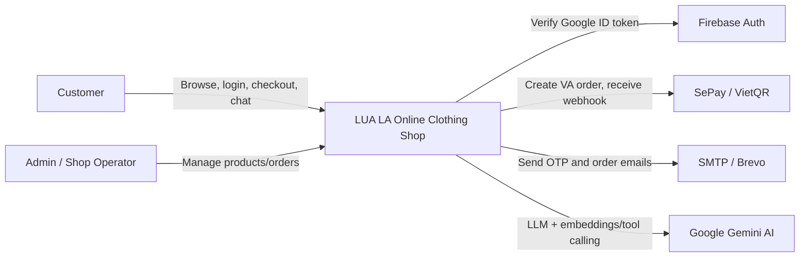
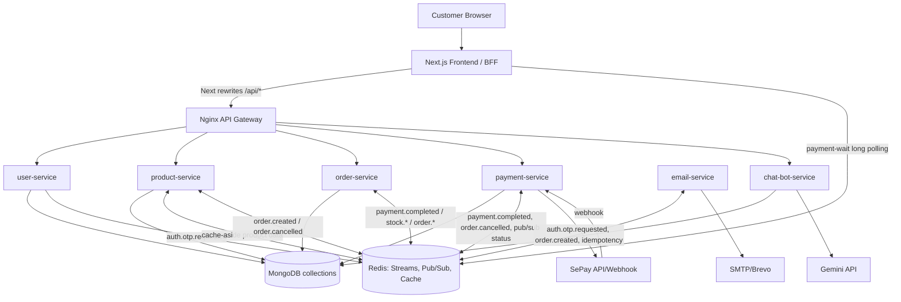

# LUA LA Online Clothing Shop - Architecture and Design Report

Tai lieu nay tong hop kien truc, pattern, trade-off va so do C4 cho project `online-clothing-shop`. Noi dung duoc canh theo rubric trong `Grade_guide_29052026.docx` va danh sach chuan bi bao cao trong `NoiDungChuanBiBaocao.docx`.

## 1. Muc Tieu He Thong

LUA LA la he thong ban quan ao truc tuyen gom frontend Next.js va cac backend microservices NestJS. He thong ho tro:

- Xem danh sach san pham, loc/tim kiem/sap xep, xem chi tiet san pham.
- Gio hang, wishlist theo user/guest, checkout COD hoac chuyen khoan ngan hang.
- Dang ky, dang nhap email/password, Google login, xac thuc OTP, reset password.
- Xu ly thanh toan SePay/VietQR bang webhook va tu dong tao don hang sau khi thanh toan thanh cong.
- Gui email OTP va email xac nhan don hang bang email-service.
- AI chatbot dung Gemini de tu van san pham, semantic/vector search, them vao gio hang va cap nhat profile khi user da dang nhap.

## 2. Tong Quan Kien Truc

He thong ap dung kien truc chinh la **Microservices + Event-Driven Architecture**, ket hop:

- **API Gateway pattern**: Nginx gateway dinh tuyen request den tung service.
- **BFF/rewrite pattern** o frontend: Next.js rewrite `/api/*` sang backend service, giu browser same-origin.
- **Layered architecture trong moi service**: `Controller -> Service -> Mongoose Model/Redis/External API`.
- **Event-driven workflow**: Redis Streams dung cho OTP email, order lifecycle, stock reservation, payment completion.
- **Cache-aside**: product-service dung Redis cache cho product list va product detail.
- **Saga choreography**: cac service phoi hop bang event de xu ly order/payment/stock, khong dung distributed transaction 2PC.
- **AI Agent/tool-calling**: chat-bot-service goi Gemini, dung function calling de search product, add cart, update profile.

He thong dang dung **MongoDB** qua Mongoose cho moi service co du lieu nghiep vu. Cach cau hinh hien tai cho phep moi service dung `MONGO_URI` rieng trong `.env`; trong bao cao nen trinh bay theo huong moi bounded context co data ownership rieng. Redis dong vai tro cache, event bus va pub/sub cho payment status.

## 3. Service Inventory

| Thanh phan | Port | Trach nhiem | Data/External dependency |
|---|---:|---|---|
| Frontend | 3000/Vercel | UI, BFF rewrites, protected routes, local cart/wishlist, payment waiting route | Next.js, React, Firebase client, Redis subscriber trong route payment-wait |
| Nginx Gateway | 80 | Reverse proxy vao user/product/order/payment/chatbot | Docker DNS, EC2 IP env |
| user-service | 8081 | Auth, profile, OTP, JWT cookie, Google/Firebase login | MongoDB users/otps, Redis Streams, Firebase Admin |
| product-service | 8083 | Product CRUD, search/filter/sort/pagination, stock reserve/release, cache | MongoDB products, Redis cache, Redis Streams |
| order-service | 8084 | Order creation/query/status, materialize order from payment event, cancel/confirm order | MongoDB orders, Redis Streams, HTTP call to payment-service |
| payment-service | 8085 | SePay checkout intent, webhook reconciliation, payment state, refund marker, WebSocket/pubsub status | MongoDB payments, SePay API, Redis Streams/PubSub |
| email-service | 8087 | Send OTP and order confirmation emails | SMTP/Brevo, Redis Streams, Redis idempotency keys |
| chat-bot-service | 8088 | AI assistant, vector search, add-to-cart actions, profile updates | Gemini API, MongoDB products/users, JWT verification |

## 4. C4 Diagrams

Source files:

- Context: [`docs/diagrams/c4-context.mmd`](diagrams/c4-context.mmd)
- Container: [`docs/diagrams/c4-container.mmd`](diagrams/c4-container.mmd)
- Component: [`docs/diagrams/c4-backend-components.mmd`](diagrams/c4-backend-components.mmd)
- Checkout sequence: [`docs/diagrams/sequence-bank-transfer.mmd`](diagrams/sequence-bank-transfer.mmd)
- C4-PlantUML Context: [`docs/diagrams/c4-context.puml`](diagrams/c4-context.puml)
- C4-PlantUML Container: [`docs/diagrams/c4-container.puml`](diagrams/c4-container.puml)

### 4.1 C4 System Context

### 4.2 C4 Container

## 5. Kien Truc Runtime Va Deployment

### Local/Single Host

`docker-compose.yml` build 6 services, gan port `127.0.0.1:<port>:<port>` de chi expose local. Tat ca services cung nam trong Docker network `appnet`, goi nhau bang service name nhu `payment-service:8085`.

### Split EC2 Deployment

`docker-compose.ec2-1.yml`:

- user-service, product-service, order-service, nginx-gateway.
- Nginx expose port 80.
- `/payments`, `/chatbot`, `/chat` proxy sang `${EC2_2_IP}`.

`docker-compose.ec2-2.yml`:

- payment-service, email-service, chat-bot-service.
- Expose 8085, 8087, 8088.

Trade-off cua split EC2: tiet kiem tai nguyen va tach nhom service theo vai tro, nhung them do phuc tap network/security group. Loi timeout `EC2-1 -> EC2-2:8085` la vi du ro rang: service local OK nhung gateway khong reach duoc qua network.

## 6. Cac Luong Nghiep Vu Chinh

### 6.1 Login Email/Password

1. Browser goi `/api/auth/login`.
2. Next rewrite sang `user-service /api/auth/login`.
3. AuthService tim user theo email, check verified, so sanh bcrypt password.
4. user-service tao JWT access/refresh token.
5. AuthController set `access_token`, `refresh_token` bang HttpOnly cookie.
6. Frontend AuthProvider goi `/api/auth/me` de load user.

### 6.2 Register + OTP Email

1. User dang ky email/password/fullName.
2. user-service hash password va luu user chua verified.
3. user-service tao OTP trong MongoDB `otps`.
4. user-service publish `streams.auth.otp.requested`.
5. email-service consume event, claim idempotency key trong Redis bang `SET NX EX`, render template OTP, gui SMTP.
6. User submit OTP, user-service verify va set `isVerified=true`.

### 6.3 COD Checkout

1. Frontend checkout goi `/api/orders`.
2. order-service tao order `paymentStatus=PENDING`, `orderStatus=PENDING_STOCK`.
3. order-service publish `order.created`.
4. product-service consume `order.created`, reserve stock.
5. Neu reserve thanh cong: product-service publish `stock.reserved`, order-service confirm order.
6. Neu reserve fail: product-service publish `stock.failed`, order-service cancel order va publish `order.cancelled`.
7. email-service consume `order.created` de gui email xac nhan.

### 6.4 Bank Transfer Checkout With SePay

1. Frontend goi `/api/payments/checkout-intent`.
2. payment-service goi SePay API tao virtual account/QR, luu payment `PENDING` kem `pendingCheckout`.
3. Frontend hien QR va long-poll `/api/payment-wait/:paymentId`.
4. SePay goi webhook ve payment-service.
5. payment-service reconcile bang transfer content/VA/account, mark payment `COMPLETED`.
6. payment-service notify WebSocket/PubSub `payment:status:<id>`, publish `payment.completed`.
7. order-service consume `payment.completed`, tao Order idempotently bang unique sparse `paymentId`.
8. order-service backfill `orderId` ve payment-service qua PATCH `/payments/:paymentId/link-order`.
9. Product stock reservation va email confirmation chay tiep bang event.

## 7. Pattern Da Su Dung

| Pattern | Noi dung trong code | Loi ich | Trade-off |
|---|---|---|---|
| Microservices | Moi domain la mot NestJS service rieng | De scale/deploy theo capability | Tang do phuc tap network, observability, versioning |
| API Gateway | Nginx route `/api/auth`, `/products`, `/orders`, `/payments` | Mot entry point cho client | Gateway thanh diem nghen neu khong scale/monitor |
| BFF / Rewrite | `frontend/next.config.ts` rewrite `/api/*` | Giam CORS, giu cookie same-origin | Them mot lop proxy/debug phuc tap hon |
| Layered architecture | Controller-Service-Model trong moi service | Tach HTTP, business logic, persistence | Chua co repository abstraction rieng nen Service con biet Mongoose |
| Dependency Injection | NestJS modules/providers | Giam coupling, testable hon | Phu thuoc framework NestJS |
| DTO + ValidationPipe | order/payment DTO class-validator | Bao ve boundary input | Product/user chua validate dong deu bang DTO |
| Cache-aside | product-service Redis cache list/detail | Tang performance doc san pham | Co nguy co stale cache, can invalidation |
| Event-driven | Redis Streams cho auth/order/payment/stock/email | Decouple, retry duoc, fault tolerance hon HTTP chain | Eventual consistency, can idempotency va monitoring |
| Saga choreography | order/payment/product phoi hop qua event | Khong can distributed transaction | Debug luong phan tan kho hon orchestration |
| Idempotent consumer | email Redis `SET NX`, order unique `paymentId`, stable eventId | Xu ly duplicate/redelivery an toan | Can thiet ke key/TTL dung |
| Pub/Sub + long polling | payment status qua Redis Pub/Sub + Next route | UI cap nhat nhanh khi SePay webhook ve | Pub/Sub khong durable; da co fallback DB check |
| WebSocket gateway | payment-service `/payments/ws` | Real-time notification | Frontend hien dang uu tien long polling |
| Local state provider | Auth/Cart/Wishlist Context | Don gian, hop Next client components | localStorage khong phu hop multi-device cart |
| AI tool calling | chatbot Gemini function calling | Agent co the thao tac san pham/profile | Can guardrails, cost/latency, data privacy |

## 8. Nguyen Tac Thiet Ke

- **Separation of concerns**: UI, auth, product, order, payment, email, AI duoc tach thanh module/service rieng.
- **Single Responsibility Principle**: email-service chi gui email; payment-service chi quan ly payment; product-service quan ly catalog/stock.
- **Bounded Context**: moi service lam chu domain model rieng: `User`, `Product`, `Order`, `Payment`.
- **Configuration by environment**: CORS, ports, Redis, MongoDB, Firebase, SePay, SMTP, Gemini doc tu `.env`. Dac biet CORS dung `CORS_ALLOWED_ORIGINS` theo rule cua repo.
- **Fail asynchronously when possible**: Email/stock/order lifecycle di qua Redis Streams thay vi goi HTTP dong bo het.
- **Idempotency first**: Stream co the deliver lai, nen email-service va order-service co co che dedupe.
- **Least exposure**: local compose bind service ports vao `127.0.0.1`; split EC2 chi expose cac port can thiet.
- **Graceful degradation**: email-service co `MAIL_ENABLED=false` mock mode; payment-wait neu Redis loi thi tra `PENDING` de client retry.

## 9. Architecture Characteristics Theo Rubric

### Availability

- Docker Compose dung `restart: unless-stopped`.
- Event-driven voi Redis Streams giup message khong mat khi consumer chet giua chung; consumer co `XAUTOCLAIM` de lay lai pending message.
- Split EC2 co the tach tai, nhung hien chua co load balancer/multi-instance nen availability van phu thuoc tung VM.

### Performance

- Product list/detail dung Redis cache-aside:
  - list TTL 5 phut, track key list de invalidation khi create/update/delete.
  - detail TTL 1 gio.
- Product query co pagination, filter, sort, search regex.
- Chatbot dung MongoDB vector search de tim san pham theo ngu nghia.

### Fault Tolerance

- Redis client co retry strategy va offline queue.
- StreamConsumer doc backlog, retry khi handler fail, `XAUTOCLAIM` stale pending.
- Frontend checkout co timeout rieng de tranh UI treo khi gateway/upstream timeout.
- Thieu: server/gateway rate limiter chua duoc implement ro trong code; nen dua vao roadmap hoac demo bo sung neu muon an diem rubric.

### Security

- JWT access/refresh token dat trong HttpOnly cookie.
- JwtStrategy doc token tu cookie hoac Bearer header.
- Password hash bang bcrypt.
- Google login verify bang Firebase Admin.
- SePay webhook kiem tra Authorization token.
- CORS origin doc tu `.env`, khong hardcode wildcard.
- Thieu: refresh-token rotation, CSRF protection cho cookie auth, rate limit login/OTP, centralized secret management.

### Scalability

- Stateless NestJS services co the scale horizontal.
- Redis Streams consumer group ho tro nhieu consumer cung group xu ly message song song.
- Product cache giam tai DB khi traffic doc tang.
- Bottleneck hien tai: MongoDB, Redis, Nginx gateway, SePay external API, single EC2 instance neu chua co autoscaling/load balancer.

### Maintainability

- Cau truc folder theo domain module cua NestJS.
- Event contract `event-types.ts` giong nhau giua services, de hieu luong.
- Trade-off: event contract bi duplicate trong tung service, de drift neu sua mot noi quen sua noi khac. Nen tach shared package hoac contract repo.

## 10. CQRS Va Event Sourcing

### CQRS

He thong **chua ap dung CQRS hoan chinh**. Command va Query van dung chung service/model/database. Tuy nhien co mot so y tuong gan CQRS:

- Product read path co cache-aside de toi uu doc.
- Bank-transfer write flow tach thanh Payment Intent -> Payment Completed Event -> Order materialization.
- Frontend query order/payment rieng theo endpoint doc.

Neu hoi trong bao cao: cau tra loi nen la "he thong co tach mot phan read optimization bang Redis cache, nhung chua tach rieng command model va query model tu code den database".

### Event Sourcing

He thong **khong dung Event Sourcing day du**. Redis Streams luu event de giao tiep va retry, nhung source of truth van la MongoDB document hien tai (`orders`, `payments`, `products`). Khong replay event de tinh state cuoi cung.

## 11. Sync vs Async

| Loai | Vi du | Ly do |
|---|---|---|
| Sync HTTP | Frontend -> Gateway -> service; order-service PATCH payment link-order; payment-service -> SePay | Can response ngay cho UI/external API |
| Async Redis Streams | OTP email, order.created, stock.reserved, stock.failed, payment.completed, order.cancelled | Giam coupling, retry, tranh mat event |
| Pub/Sub / Long polling | payment status cho UI | UI can cap nhat nhanh, fallback DB check neu Pub/Sub mat |

## 12. Trade-Off Tong Hop

| Quyet dinh | Loi ich | Chi phi / rui ro | Cach giam rui ro |
|---|---|---|---|
| Microservices thay monolith | Scale/doc lap domain, de phan cong nhom | Network, deployment, distributed debugging | Gateway, Docker Compose, log/trace, contract docs |
| Redis Streams thay HTTP chain | Fault tolerance, retry, loose coupling | Eventual consistency, duplicate message | Idempotency, stable eventId, consumer group |
| Choreography saga | Service tu chu, it central bottleneck | Kho nhin toan bo process | Sequence diagram, correlation id, monitoring |
| Cache-aside product | Tang toc doc, giam DB load | Stale cache, invalidation phuc tap | TTL + xoa cache khi mutate |
| HttpOnly cookie JWT | Giam nguy co token bi JS doc | Can CSRF consideration | SameSite, CSRF token neu mo cross-site |
| LocalStorage cart/wishlist | Don gian, nhanh, offline-ish | Khong dong bo multi-device | Sau nay them cart-service |
| Split EC2 | Tach tai, de demo service distribution | Security group/network timeout | Dung private IP, health check, LB |
| AI chatbot | Tang diem AI/Agent, UX tot | Cost, latency, hallucination, privacy | Tool calling voi DB thuc, guardrails, auth check |

## 13. Cau Hoi Kien Truc Mau

**Du an dang ap dung kien truc nao?**  
Microservices architecture ket hop event-driven architecture. Frontend Next.js dong vai tro BFF/rewrite, Nginx lam API gateway, Redis lam cache/event bus.

**Vi sao chon microservices?**  
Domain ban hang co nhieu capability tach biet: user/auth, product/catalog, order, payment, email, AI. Tach service giup moi nhom phat trien/doc lap va scale phan doc san pham/thanh toan/email khac nhau.

**He thong dam bao nhat quan du lieu the nao?**  
Khong dung distributed transaction. He thong chap nhan eventual consistency va dung Saga choreography: payment/order/product trao doi event. Idempotency va unique index giup tranh tao trung don/email trung khi event redelivery.

**Traffic tang dot bien o trang collections thi sao?**  
Scale product-service horizontal, scale Redis/Mongo, dung cache-aside product list/detail, them CDN/cache header cho static assets, them Nginx/Load Balancer.

**Neu payment-service down khi SePay webhook goi ve?**  
Webhook se fail; SePay thuong co retry tuy cau hinh. Nen co retry policy/webhook queue. Khi service len lai, payment intent van trong MongoDB. Neu webhook da duoc nhan va Redis loi, code hien ACK webhook nhung log loi publish; can bo sung outbox pattern de dam bao event khong mat.

**Diem nghen lon nhat hien tai?**  
Redis la event/cache dependency trung tam; MongoDB la persistence bottleneck; Nginx gateway single instance; EC2 network/security group khi split deployment.

**Co dung rate limiter khong?**  
Chua thay implement ro trong source. Nen them rate limiter o Nginx hoac NestJS cho login, OTP, chatbot, checkout de dat diem rubric Fault Tolerance/Security.

## 14. De Xuat Cai Thien De Dat Rubric Cao Hon

1. Them health endpoint dong deu cho moi service (`/health`) kiem tra MongoDB/Redis/SMTP/SePay.
2. Them rate limiter:
   - Nginx `limit_req` cho `/api/auth`, `/payments`, `/chatbot`.
   - NestJS `@nestjs/throttler` cho login/OTP/chatbot.
3. Them GitLab CI/CD hoac GitHub Actions build/test/docker image.
4. Them centralized logging/correlation id: Nginx request id -> service logs -> event envelope.
5. Them outbox pattern cho payment-service/order-service de khong mat event neu Redis loi sau khi DB save.
6. Tach shared event contract package de tranh duplicate `event-types.ts`.
7. Them database migration/index scripts, dac biet unique indexes cho `paymentId`, `transferContent`.
8. Them monitoring: Prometheus/Grafana hoac at least Docker healthcheck + log aggregation.
9. Them cart-service neu can sync gio hang multi-device.

## 15. Mapping Voi Rubric

| Rubric | Hien trang | Diem manh | Khoang trong |
|---|---|---|---|
| C4 Context/Container | Co trong docs/diagrams | Actor, service, DB, external systems ro | Can render vao slide |
| Architecture Diagram | Co tong quan va sequence checkout | The hien sync/async | Nen them screenshot deploy neu co |
| Redis Performance | Product cache, Streams, Pub/Sub | Dung Redis hop ly | Can benchmark/demo cache hit |
| Fault Tolerance retry | Redis retry, Stream pending reclaim, frontend timeout | Co co che retry event | Rate limiter chua co |
| JWT Security | Cookie JWT + Firebase | Auth ro | Can CSRF/rate limit |
| Scalability | Microservices + consumer groups + cache | Scale theo service | Chua co LB/autoscaling |
| Docker Compose | Co local va split EC2 compose | Demo deploy tot | CI/CD chua thay |
| AI Agent | Gemini tool calling | Search/add cart/update profile | Can guardrail/cost note |

## 16. Goi Y Slide 15-20 Trang

1. Title + team.
2. Problem statement va scope.
3. Main functions.
4. Technology stack.
5. C4 Context.
6. C4 Container.
7. Backend component diagram.
8. Request flow: login/auth.
9. Request flow: COD checkout.
10. Request flow: bank transfer SePay.
11. Redis Streams and Saga.
12. Cache-aside product performance.
13. Security design.
14. AI Agent design.
15. Deployment/Docker/EC2.
16. Trade-offs.
17. Limitations and roadmap.
18. Demo script.
19. Q&A architecture answers.
20. Contribution table.
